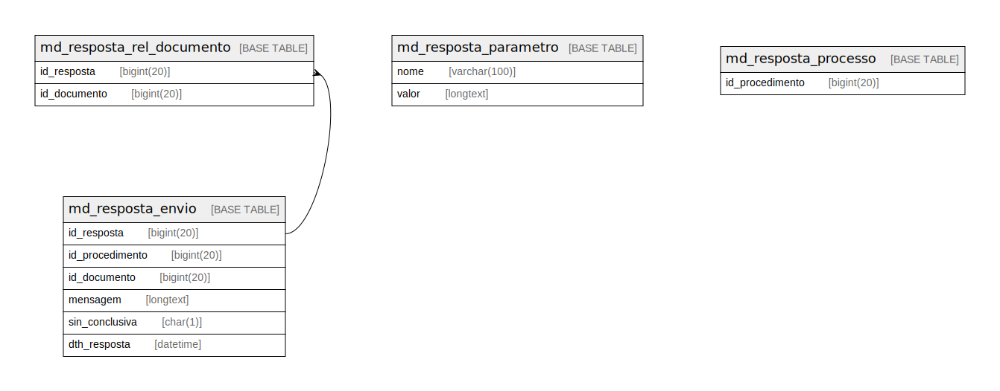

# sei

## Tables

| Name | Columns | Comment | Type |
| ---- | ------- | ------- | ---- |
| [md_resposta_envio](md_resposta_envio.md) | 6 |  | BASE TABLE |
| [md_resposta_parametro](md_resposta_parametro.md) | 2 |  | BASE TABLE |
| [md_resposta_processo](md_resposta_processo.md) | 1 |  | BASE TABLE |
| [md_resposta_rel_documento](md_resposta_rel_documento.md) | 2 |  | BASE TABLE |

## Relations

---

> Generated by [tbls](https://github.com/k1LoW/tbls)
