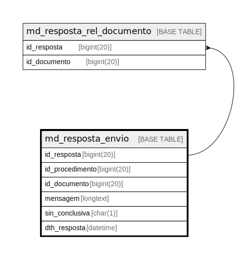

# md_resposta_envio

## Description

<details>
<summary><strong>Table Definition</strong></summary>

```sql
CREATE TABLE `md_resposta_envio` (
  `id_resposta` bigint(20) NOT NULL,
  `id_procedimento` bigint(20) NOT NULL,
  `id_documento` bigint(20) NOT NULL,
  `mensagem` longtext NOT NULL,
  `sin_conclusiva` char(1) NOT NULL,
  `dth_resposta` datetime NOT NULL,
  PRIMARY KEY (`id_resposta`),
  KEY `fk_md_resposta_procedimento` (`id_procedimento`),
  KEY `fk_md_resposta_documento` (`id_documento`),
  CONSTRAINT `fk_md_resposta_documento` FOREIGN KEY (`id_documento`) REFERENCES `documento` (`id_documento`),
  CONSTRAINT `fk_md_resposta_procedimento` FOREIGN KEY (`id_procedimento`) REFERENCES `procedimento` (`id_procedimento`)
) ENGINE=InnoDB DEFAULT CHARSET=latin1 COLLATE=latin1_swedish_ci
```

</details>

## Columns

| Name | Type | Default | Nullable | Children | Parents | Comment |
| ---- | ---- | ------- | -------- | -------- | ------- | ------- |
| id_resposta | bigint(20) |  | false | [md_resposta_rel_documento](md_resposta_rel_documento.md) |  |  |
| id_procedimento | bigint(20) |  | false |  |  |  |
| id_documento | bigint(20) |  | false |  |  |  |
| mensagem | longtext |  | false |  |  |  |
| sin_conclusiva | char(1) |  | false |  |  |  |
| dth_resposta | datetime |  | false |  |  |  |

## Constraints

| Name | Type | Definition |
| ---- | ---- | ---------- |
| fk_md_resposta_documento | FOREIGN KEY | FOREIGN KEY (id_documento) REFERENCES documento (id_documento) |
| fk_md_resposta_procedimento | FOREIGN KEY | FOREIGN KEY (id_procedimento) REFERENCES procedimento (id_procedimento) |
| PRIMARY | PRIMARY KEY | PRIMARY KEY (id_resposta) |

## Indexes

| Name | Definition |
| ---- | ---------- |
| fk_md_resposta_documento | KEY fk_md_resposta_documento (id_documento) USING BTREE |
| fk_md_resposta_procedimento | KEY fk_md_resposta_procedimento (id_procedimento) USING BTREE |
| PRIMARY | PRIMARY KEY (id_resposta) USING BTREE |

## Relations



---

> Generated by [tbls](https://github.com/k1LoW/tbls)
