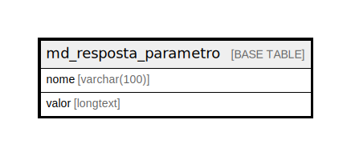

# md_resposta_parametro

## Description

<details>
<summary><strong>Table Definition</strong></summary>

```sql
CREATE TABLE `md_resposta_parametro` (
  `nome` varchar(100) NOT NULL,
  `valor` longtext NOT NULL,
  PRIMARY KEY (`nome`)
) ENGINE=InnoDB DEFAULT CHARSET=latin1 COLLATE=latin1_swedish_ci
```

</details>

## Columns

| Name | Type | Default | Nullable | Children | Parents | Comment |
| ---- | ---- | ------- | -------- | -------- | ------- | ------- |
| nome | varchar(100) |  | false |  |  |  |
| valor | longtext |  | false |  |  |  |

## Constraints

| Name | Type | Definition |
| ---- | ---- | ---------- |
| PRIMARY | PRIMARY KEY | PRIMARY KEY (nome) |

## Indexes

| Name | Definition |
| ---- | ---------- |
| PRIMARY | PRIMARY KEY (nome) USING BTREE |

## Relations



---

> Generated by [tbls](https://github.com/k1LoW/tbls)
