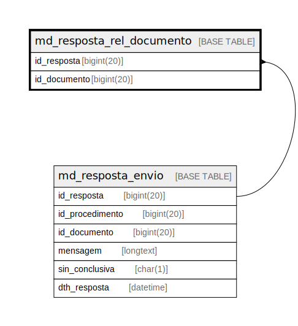

# md_resposta_rel_documento

## Description

<details>
<summary><strong>Table Definition</strong></summary>

```sql
CREATE TABLE `md_resposta_rel_documento` (
  `id_resposta` bigint(20) NOT NULL,
  `id_documento` bigint(20) NOT NULL,
  PRIMARY KEY (`id_resposta`,`id_documento`),
  KEY `fk_md_resposta_doc_resposta` (`id_resposta`),
  CONSTRAINT `fk_md_resposta_doc_resposta` FOREIGN KEY (`id_resposta`) REFERENCES `md_resposta_envio` (`id_resposta`)
) ENGINE=InnoDB DEFAULT CHARSET=latin1 COLLATE=latin1_swedish_ci
```

</details>

## Columns

| Name | Type | Default | Nullable | Children | Parents | Comment |
| ---- | ---- | ------- | -------- | -------- | ------- | ------- |
| id_resposta | bigint(20) |  | false |  | [md_resposta_envio](md_resposta_envio.md) |  |
| id_documento | bigint(20) |  | false |  |  |  |

## Constraints

| Name | Type | Definition |
| ---- | ---- | ---------- |
| fk_md_resposta_doc_resposta | FOREIGN KEY | FOREIGN KEY (id_resposta) REFERENCES md_resposta_envio (id_resposta) |
| PRIMARY | PRIMARY KEY | PRIMARY KEY (id_resposta, id_documento) |

## Indexes

| Name | Definition |
| ---- | ---------- |
| fk_md_resposta_doc_resposta | KEY fk_md_resposta_doc_resposta (id_resposta) USING BTREE |
| PRIMARY | PRIMARY KEY (id_resposta, id_documento) USING BTREE |

## Relations



---

> Generated by [tbls](https://github.com/k1LoW/tbls)
